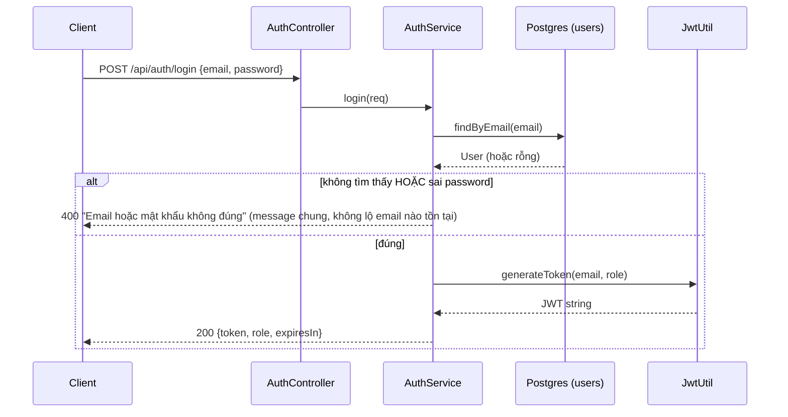
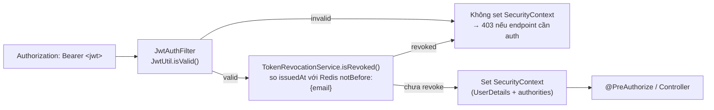
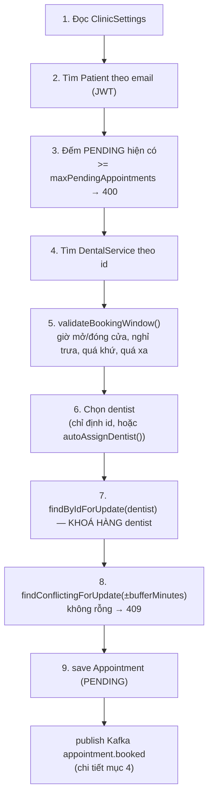
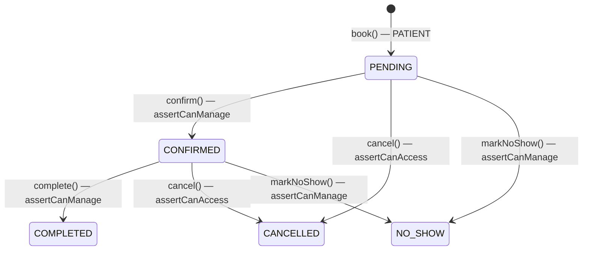
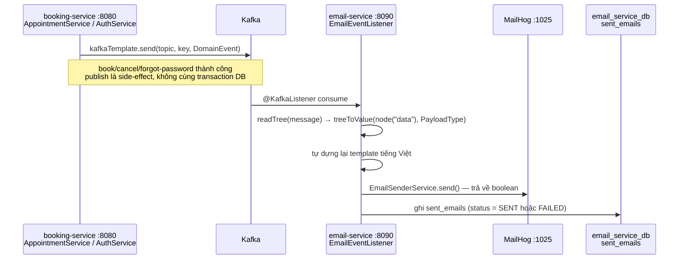
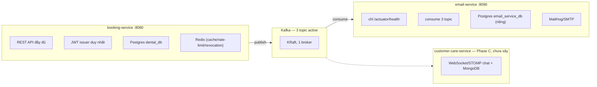

# Antijob — Tài liệu hệ thống (Login/JWT, đặt lịch, gửi email qua Kafka, kiến trúc microservice)

> Dựng trực tiếp từ source code sau Phase 18 Phase B (2026-08-17). Xem `CLAUDE.md` để biết lịch sử/quyết định đầy đủ theo từng phase — file này chỉ tập trung vào **cơ chế hoạt động hiện tại**.

## Mục lục

- [1. Trạng thái hệ thống](#1-trạng-thái-hệ-thống)
- [2. Login / JWT](#2-login--jwt)
- [3. Đặt lịch & vòng đời appointment](#3-đặt-lịch--vòng-đời-appointment)
- [4. Gửi email — qua Kafka, không còn gọi trực tiếp](#4-gửi-email--qua-kafka-không-còn-gọi-trực-tiếp)
- [5. Kiến trúc microservice hiện tại](#5-kiến-trúc-microservice-hiện-tại)

---

## 1. Trạng thái hệ thống

| Thành phần | Port | Vai trò |
|---|---|---|
| `booking-service` | `8080` | REST API đầy đủ, JWT issuer duy nhất |
| `email-service` | `8090` | Chỉ `/actuator/health` — không REST API khác, thuần consumer |
| Postgres (1 container) | `5432` | 2 database: `dental_db` (booking) + `email_service_db` (email-service) |
| Redis | `6379` | Cache/rate-limit/JWT revocation — chỉ booking-service dùng |
| Kafka | `9092` nội bộ / `9094` host | 3 topic đang hoạt động |
| Kafka UI | `8081` | Xem topic/message trực quan |
| MailHog | `1025` SMTP / `8025` Web UI | Nhận mail thật do email-service gửi |

---

## 2. Login / JWT

Booking-service là nơi **duy nhất** phát hành JWT (`JwtUtil.generateToken`). email-service không xác thực ai cả — nó không nhận request từ người dùng, chỉ tiêu thụ Kafka.

### 2.1 Đăng nhập → phát token

Token chứa 2 claim nghiệp vụ: `email` (subject) và `role`. Không có claim nào định danh microservice khác — email-service (và tương lai customer-care-service) verify JWT bằng cách **tự copy logic `JwtUtil`**, không gọi ngược lại booking-service qua network.

### 2.2 Xác thực mỗi request tiếp theo

`JwtAuthFilter` chạy sau `CorrelationIdFilter` nhưng trước mọi `@PreAuthorize`. Thu hồi token (logout / đổi mật khẩu / reset mật khẩu) chỉ ghi **1 mốc thời gian** vào Redis (`token:notBefore:{email}`) — không "xoá" JWT nào cả, vì JWT vốn stateless. Mọi token phát hành **trước** mốc đó bị coi là đã thu hồi, ở mọi thiết bị.

---

## 3. Đặt lịch & vòng đời appointment

`AppointmentController`/`AppointmentService` — nghiệp vụ trung tâm, nơi có logic phức tạp nhất hệ thống.

### 3.1 `book()` — 9 bước, chống double-booking

`@CacheEvict("slots")` áp trên toàn hàm — bất kỳ đặt lịch nào cũng xoá sạch cache slot Redis.

**Bước 6→7 là chỗ chống race condition then chốt**: khoá hàng dentist (`SELECT ... FOR UPDATE`) **trước** rồi mới đọc conflict — nếu đảo thứ tự, 2 request đặt cùng 1 slot hoàn toàn trống có thể cùng thấy "chưa có gì để khoá", cùng pass check, và cùng insert (bug thật đã sửa ở Phase 17, verify bằng race test thật với 2 curl đồng thời).

### 3.2 Vòng đời trạng thái — 5 endpoint, 2 mức quyền khác nhau

| Method | Quyền | Ai được phép |
|---|---|---|
| `confirm()` / `complete()` / `markNoShow()` | `assertCanManage` | ADMIN, RECEPTIONIST, **hoặc dentist được giao lịch** |
| `cancel()` | `assertCanAccess` (chặt hơn) | Chỉ **chủ lịch (patient)** hoặc ADMIN — **không phải** dentist/receptionist |

Điểm review đáng chú ý: dentist được giao lịch có thể confirm/complete/no-show lịch đó, nhưng **không được** tự huỷ lịch của bệnh nhân. Chỉ `book()` và `cancel()` publish Kafka event (mục 4) — `confirm()`/`complete()`/`markNoShow()` không phát email vì chưa có nhu cầu nghiệp vụ đó.

---

## 4. Gửi email — qua Kafka, không còn gọi trực tiếp

**Đổi quan trọng nhất kể từ Phase 18 Phase B**: booking-service **không tự gửi email nữa**. Nó chỉ publish 1 event lên Kafka; toàn bộ việc gửi mail thật, dựng template, và ghi audit log là việc của `email-service` — 1 process hoàn toàn riêng biệt, chạy port khác, database khác.

### 4.1 3 topic đang hoạt động

| Nghiệp vụ | Topic | Key | Subject email | Người nhận |
|---|---|---|---|---|
| Đặt lịch thành công | `appointment.booked` | `appointmentId` | "Xác nhận đặt lịch hẹn" | patient |
| Huỷ lịch | `appointment.cancelled` | `appointmentId` | "Huỷ lịch hẹn" | patient |
| Quên mật khẩu | `auth.password-reset-requested` | `userEmail` | "Đặt lại mật khẩu" | user (mọi role) |

### 4.2 Quyết định thiết kế đáng nhớ

- **Audit log ghi mọi lần xử lý, kể cả khi gửi thất bại** — cột `status` là `SENT`/`FAILED`. Khác biệt có chủ đích với `EmailService` cũ (đã xoá khỏi booking-service): trước đây lỗi SMTP bị nuốt im lặng chỉ log server; giờ gửi mail **LÀ nghiệp vụ chính** của email-service nên listener cần biết kết quả thật để ghi đúng audit.
- **Không deserialize `DomainEvent<T>` bằng type token** — mỗi topic có payload khác nhau và email-service cố tình không share jar với booking-service, nên listener tự `readTree()` message rồi `treeToValue()` đúng field `"data"` sang payload cụ thể của nó. Đơn giản hơn nhiều so với vật lộn `TypeReference` generic.
- **Publish Kafka là side-effect ở phía booking-service** — `kafkaTemplate.send()` không nằm trong cùng transaction DB, lỗi Kafka không làm fail nghiệp vụ đặt/huỷ lịch (đúng triết lý "email không được chặn nghiệp vụ chính" đã có từ trước, giờ áp dụng cho publish thay vì gửi trực tiếp).

---

## 5. Kiến trúc microservice hiện tại

Đang tách dần từ monolith sang 3 service độc lập (Phase 18 trong roadmap). Hiện đã xong 2/4 phase.

2 service **không gọi REST lẫn nhau** — mọi giao tiếp nghiệp vụ đi qua Kafka. Không có API Gateway/service discovery (chưa cần ở quy mô 2-3 service cho mục đích học tập/portfolio này) — client gọi thẳng booking-service, email-service hoàn toàn bị động phía sau.

### 5.1 Tiến độ 4 phase

Kế hoạch đầy đủ: `C:\Users\ADMIN\.claude\plans\linked-crunching-dahl.md`

| Phase | Nội dung | Trạng thái |
|---|---|---|
| A | Hạ tầng Kafka + booking-service publish event (song song email trực tiếp) | ✅ xong 2026-08-06 |
| B | email-service tách riêng, xoá gửi email trực tiếp khỏi booking-service | ✅ xong 2026-08-17 |
| C | customer-care-service — WebSocket/STOMP chat, MongoDB, publish `chat.message-sent` | ⏳ chưa bắt đầu |
| D | Orchestration đầy đủ (docker-compose root, CI riêng từng service), docs | ⏳ chưa bắt đầu |

### 5.2 Điểm coupling hạ tầng duy nhất, có chủ đích

2 service **không** share code (không multi-module Gradle, không jar chung cho `DomainEvent<T>`/payload — mỗi bên tự định nghĩa lại) và **không** gọi REST lẫn nhau. Điểm chung duy nhất: cùng chạy trên 1 Postgres *instance* vật lý (khác database), và cùng đọc chung Kafka bootstrap-servers/MailHog. Đây là coupling hạ tầng dev, không phải coupling code — đúng tinh thần "3 sản phẩm deploy độc lập" đã chốt trong kế hoạch.
